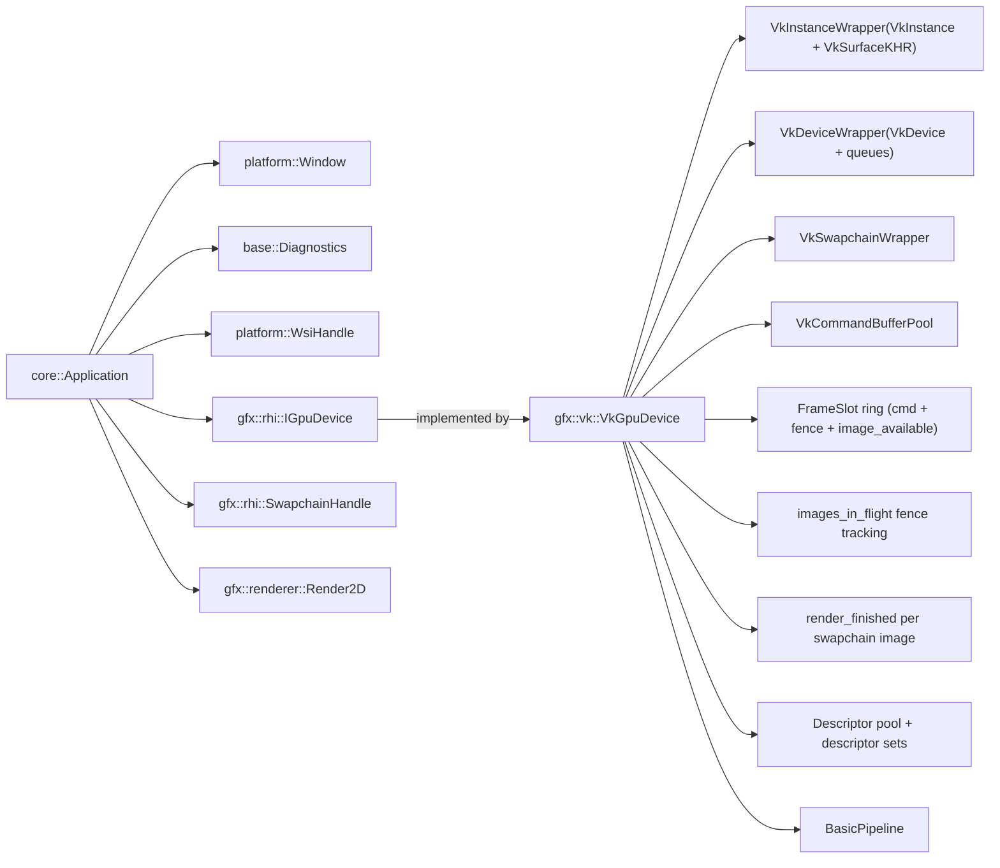

# Strata Architecture

> **TL;DR**: Strata is a learning-focused, production-leaning Vulkan engine. The codebase is organized into clear layers:  
> **base** (diagnostics + low-level utilities) → **platform** (OS/window/WSI handles) ← **core** (app orchestration + runtime helpers) → **gfx** (RHI + renderer + Vulkan backend).

This document explains Strata’s *current* architecture: module boundaries, dependency rules, and the “shape” of the runtime object graph.  
It favors pragmatism over consistency, and consistency over cleverness, and should be treated as a living document.

---

## Goals

### Primary goals
- **Learn Vulkan by building a real engine**: keep abstractions honest and testable.
- **Production-leaning structure**: prefer clean ownership, clear boundaries, and predictable lifetimes.
- **Contain Vulkan complexity**: keep raw Vulkan types and usage inside the Vulkan backend (`gfx/backend/vk/*` (namespace `strata::gfx::vk`)).

### Secondary goals (future)
- **ECS** (not the focus yet)
- **Data-driven content/config** (not the focus yet)
- **Multithreading** (not the focus yet)

---

## Non-goals (for now)
- A fully general “abstract-everything” renderer API.
- A complete, feature-rich engine editor/toolchain.
- A fully modular plug-in architecture (some parts are designed for replaceability, but the project is still early).

---

## Codebase layout

> Folder names below represent conceptual modules; exact paths may vary.

```
engine/base         → dependency-free utilities (diagnostics, assertions, helpers)
engine/platform     → OS + windowing + input + WSI handle production
engine/core         → application wrapper, (future) ECS, action map + runtime helpers
engine/gfx          → graphics abstractions, rhi/*, renderer/*, backend/vk/*, shaders/*
```

### `engine/base`
Responsibilities:
- Dependency-free utilities and building blocks (no OS/Vulkan deps).
- Explicitly-owned diagnostics (logging + assertions) designed to be passed down intentionally (no global state).

Key types:
- `strata::base::Diagnostics` (owns a `Logger` and assertion/fatal behavior)
- `strata::base::Logger` (owns sinks; e.g., `StderrSink`)
- `strata::base::ILogSink`, `strata::base::LogRecord`, `strata::base::LogLevel`

### `engine/platform`
Responsibilities:
- Window creation & event polling (pImpl keeps OS headers out of public headers).
- Raw input snapshot (`platform::InputState`) owned by `platform::Window` and refreshed by `poll_events()` (keys/buttons down + per-frame deltas).
- WSI integration (Win32/X11/Wayland) via a **platform-neutral handle type**: `platform::WsiHandle`.
- Platform-facing types like `WindowDesc`, `Extent2d`.

Key types:
- `strata::platform::Window` (PImpl; move-only; owns native window resources)
- `strata::platform::InputState` (per-window raw input snapshot: key/button down state + mouse/wheel deltas)
- `strata::platform::Key`, `strata::platform::MouseButton` (input enums)
- `strata::platform::WsiHandle` (a `std::variant` of `platform::wsi::Win32 | X11 | Wayland`)
- `strata::platform::wsi::*` (Win32/X11/Wayland “native handle bundles”, stored as integers/pointers)

> Important nuance: `platform::WsiHandle` is **not** a Vulkan surface. It is a *non-owning descriptor* of native window state used to create a `VkSurfaceKHR` inside the Vulkan backend.

### `engine/core`
Responsibilities:
- The *application shell* that wires platform + graphics together.
- Owns a `base::Diagnostics` instance and passes it down intentionally (no global state).
- Runtime loop and per-frame context.
- Minimal input action mapping helpers (`core::ActionMap`) for game/application actions.
- High-level config and error propagation.

Key types:
- `strata::core::Application` (owning façade around an `Impl`)
- `strata::core::ApplicationConfig` (window + device + swapchain config)
- `strata::core::FrameContext` (frame index + delta time)
- `strata::core::Action` / `strata::core::ActionMap` (input-driven action mapping; built on `platform::InputState`)
- `strata::core::ApplicationError` (creation failure reasons)

### `engine/gfx`
Responsibilities:
- RHI (render hardware interface) that presents a small, stable, testable API.
- Renderer code that depends on the RHI, not on Vulkan.
- One or more backend implementations (currently Vulkan).

Submodules:
- `gfx/rhi/*`: backend-agnostic interfaces and handle types.
- `gfx/renderer/*`: higher-level rendering code (e.g., `Render2D`) built on RHI.
- `gfx/backend/vk/*` (namespace `strata::gfx::vk`): Vulkan implementation details (instance/device/swapchain/command pool/pipeline).
- `gfx/backend/vk/vk_wsi_bridge*`: platform-specific WSI bridge for:
  - required instance extensions
  - `VkSurfaceKHR` creation from `platform::WsiHandle`
- `gfx/shaders/*`: shader sources / compilation artifacts (as applicable).

---

## Dependency and layering rules

Strata aims for “layering with pragmatic escape hatches.” A good default mental model:

```
platform  ←  core  →  gfx
              ↑
           (entry point)
```

More specifically:

### Allowed dependencies
- `base` should not depend on `platform`, `core`, or `gfx`.
- Any higher layer may depend on `base` (dependency-free utilities).
- `core` may depend on `platform` and `gfx`.
- `gfx/renderer` may depend on `gfx/rhi`.
- `gfx/backend/vk` may depend on:
  - `gfx/rhi` (to implement `IGpuDevice`), and
  - `platform` (for `WsiHandle` → surface creation via the WSI bridge).
- `platform` should not depend on `gfx` or `core`.

### Strong boundary rule: Vulkan containment
- **No raw Vulkan types (`Vk*`) outside `gfx/backend/vk/*` (namespace `strata::gfx::vk`).**
- `gfx/rhi` must remain *backend-agnostic* (no Vulkan headers, no Vulkan concepts leaking into public API names unless explicitly intended).

This is the main “production-leaning” constraint: it forces clean seams and makes future refactors survivable.

---

## Third-party dependency policy

Strata is learning-focused: **avoid third-party libraries by default** so the codebase stays readable end-to-end and you’re forced to understand the full stack.

- Prefer the C++ standard library + platform APIs over external wrappers.
- Exceptions are intentional and explicit: **Vulkan** (required) and (optionally) a small **audio** backend if/when needed.
- If a third-party library feels necessary, treat it as a design decision and document the rationale (and keep it behind a narrow boundary).

## WSI bridging (platform ↔ Vulkan)

Strata intentionally separates:
- **platform**: creates/owns the native window (HWND, Display*, etc.)
- **gfx backend**: creates and owns `VkSurfaceKHR`

Mechanism:
- `platform::Window::native_wsi()` returns a `platform::WsiHandle` variant containing native handles.
- `vk_wsi_bridge_<platform>.cpp` interprets that variant and calls `vkCreate*SurfaceKHR`.
- `vk_wsi_bridge::required_instance_extensions(wsi)` returns a read-only view of the platform-required instance extensions (static arrays → returned as `std::span<std::string_view>`).

This keeps OS and Vulkan headers out of public headers, while still supporting multiple platforms.

---

## Runtime object graph

At runtime, `strata::core::Application` owns the high-level system objects and connects them:

- `base::Diagnostics` (owns logging + assertions; passed explicitly)
- `platform::Window` (owns native window)
- `platform::InputState` (raw input snapshot owned by the `Window`; queried via `window.input()`)
- `platform::WsiHandle` (non-owning descriptor derived from the native window)
- `gfx::rhi::IGpuDevice` (backend-agnostic device interface; owned via `unique_ptr`)
- `gfx::rhi::SwapchainHandle` (opaque handle managed by the GPU backend)
- `gfx::renderer::Render2D`

Inside the Vulkan backend (`gfx::vk::VkGpuDevice`):
- `VkInstanceWrapper` owns `VkInstance`, `VkSurfaceKHR`, and optional debug messenger.
- `VkDeviceWrapper` owns `VkDevice` and holds non-owning queue handles.
- `VkSwapchainWrapper` owns swapchain + image views.
- Descriptor pool + descriptor sets (v1: uniform buffers only).
- Per-frame ring resources:
  - command buffers (one per frame slot)
  - image-available semaphores (one per frame slot)
  - in-flight fences (one per frame slot)
  - render-finished semaphores (per swapchain image)
- The backend assumes Vulkan 1.3 is available and **requires**:
  - **dynamic rendering** (used in rendering path)
  - **synchronization2** (used for pipeline barriers)

### Simplified diagram (conceptual)



---

## Graphics architecture

### RHI (`gfx/rhi`)
The RHI is designed as:
- A *small* interface (`IGpuDevice`) with a handful of responsibilities:
  - create/destroy resources
  - command buffer begin/end
  - submit/present/resize
  - wait idle
- A set of **typed opaque handles** for resources:
  - `BufferHandle`, `TextureHandle`, `PipelineHandle`, `CommandBufferHandle`, `SwapchainHandle`
  - `DescriptorSetLayoutHandle`, `DescriptorSetHandle`
- POD-style “desc” structs:
  - `BufferDesc`, `TextureDesc`, `PipelineDesc`, `SwapchainDesc`, `SubmitDesc`
  - `DescriptorSetLayoutDesc`, `DescriptorWrite`

This structure keeps renderer code clean and backend-agnostic.

### Renderer (`gfx/renderer`)
`Render2D` is a higher-level renderer built on the RHI:
- Holds a pointer/reference to `IGpuDevice`
- Holds RHI handles (e.g., swapchain/pipeline, descriptor set layout/set, uniform buffer handles)
- Exposes a simple `draw_frame()` that returns `rhi::FrameResult`

### Vulkan backend (`gfx/backend/vk`)
The Vulkan backend provides the concrete implementation:
- `VkGpuDevice` implements `IGpuDevice`
- Internally owns wrapper types:
  - `VkInstanceWrapper` (instance + debug messenger + **surface**)
  - `VkDeviceWrapper` (physical device selection + logical device + queues)
  - `VkSwapchainWrapper` (swapchain images + views)
  - `VkCommandBufferPool`, `FrameSlot` ring (per-frame cmd/semaphores/fences),
    `SwapchainSync` (per-image render-finished semaphores), `BasicPipeline`, etc.
- WSI bridge:
  - `vk_wsi_bridge.h` declares the platform-neutral interface (no `<vulkan/vulkan.h>` in public headers)
  - `vk_wsi_bridge_win32.cpp`, `vk_wsi_bridge_x11.cpp` implement platform-specific surface creation

This backend is the only place where Vulkan headers/types should appear.

---

## Error handling and creation flow

Strata creation is intentionally explicit:
- `Application::create(...) -> std::expected<Application, ApplicationError>`
- Failure reasons are modeled as `ApplicationError` values:
  - `WindowCreateFailed`
  - `DeviceCreateFailed`
  - `SwapchainCreateFailed`
  - `RendererCreateFailed`

This encourages construction to be:
- deterministic
- testable
- easy to print/log

---

## Ownership and RAII conventions (architecture-level)

Strata prefers:
- **Explicit ownership** (usually “one owner”)
- **Move-only types** for unique resources (e.g., wrappers around OS/Vulkan objects)
- **RAII cleanup** at destructor boundaries

A common pattern in the codebase:
- High-level façade with a PImpl (`Window`, `Application`)
- Backend wrappers that are move-only and have `init()`/`cleanup()` pairs (Vulkan wrappers)
- Resource references across layers are done via:
  - references/pointers to stable “manager” objects (`IGpuDevice&`)
  - opaque handles for GPU resources

---

## Generated diagrams

The file `strata_core.puml` is a generated class diagram (from clang-uml).

Suggested repo layout:

```
docs/
  diagrams/
    strata_core.puml
```

---

## Open questions / future decisions

- **Value types vs reference types**:
  - Now: RHI handles are value types; owning wrappers are RAII/move-only.
  - Later: decide if more “value-like” engine types are desirable (e.g., small structs vs heap allocations).
- **Replaceability vs integration**:
  - Renderer is backend-agnostic via RHI.
  - Platform WSI is abstracted via `WsiHandle`.
  - Over time: decide whether subsystems should be “swappable” (plugins) or just “replaceable by refactor.”
- **WSI + window lifetime policy**:
  - Now: the native window is expected to outlive the Vulkan surface created from it.
  - Later: codify explicit destruction policy for native windows (especially Win32).

---

## Where to start reading the code

A suggested “follow the call graph” walkthrough:

1. `strata::core::Application::create(...)`
2. `strata::core::Application::run(...)` / main loop + `FrameContext`
3. `strata::gfx::renderer::Render2D::draw_frame()`
4. RHI calls (`IGpuDevice::begin_commands / submit / present / resize_swapchain`)
5. Vulkan backend implementation (`VkGpuDevice` and wrapper types)
6. WSI bridge (`vk_wsi_bridge_*`) + platform window backends (`window_*`)
