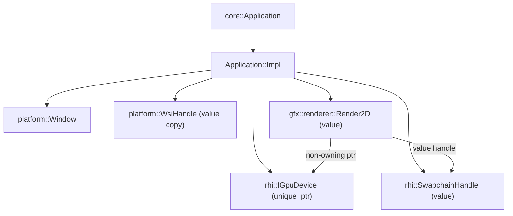

# Strata Lifetime Model

This document describes **ownership**, **construction/destruction order**, and the **safety invariants** Strata relies on today—especially around Vulkan objects and swapchain resize.

It reflects the current “production-leaning, learning-first” approach:
- Prefer **explicit ownership**
- Prefer **RAII cleanup**
- Prefer **safe destruction** (often via `wait_idle()`), even if it’s not the most performant yet

> Scope: what exists today in `core::Application`, `platform::Window`, `platform::WsiHandle`, `gfx::renderer::Render2D`, `gfx::rhi::IGpuDevice`, and the Vulkan backend (`gfx/backend/vk/*`).  
> Non-scope: future ECS lifetimes, asset systems, multithreading, streaming, etc.

---

## Key ideas (today)

### No partially-initialized `Application`
`Application::create()` returns `std::expected<Application, ApplicationError>`. If we get an `Application`, these are expected to be valid and usable:
- `platform::Window`
- `rhi::IGpuDevice`
- `rhi::SwapchainHandle`
- `renderer::Render2D`

### “GPU idle before teardown”
Strata currently uses `IGpuDevice::wait_idle()` as the main safety lever:
- `Application::Impl::~Impl()` calls `device->wait_idle()` **before** member destructors run.
- Swapchain resize also uses `wait_idle()` before recreation.
- Vulkan backend destructor (`VkGpuDevice::~VkGpuDevice`) calls `wait_idle()` before destroying Vulkan objects.

This is safe, simple, and predictable for early development.

### Renderer-owned frame recording
`Render2D::draw_frame()` drives the full frame:
> acquire → begin cmd → record → end cmd → submit → present

The Vulkan backend owns the actual `VkCommandBuffer` and sync primitives, but the renderer owns **when** command recording happens in the frame.

---

## Ownership graph

### High-level ownership (engine-side)


### Backend ownership (Vulkan)
```mermaid
flowchart TD
  D[rhi::IGpuDevice] --> VK[vk::VkGpuDevice]

  VK --> INST[vk::VkInstanceWrapper owns VkInstance + VkSurfaceKHR + Debug Messenger]
  VK --> DEV[vk::VkDeviceWrapper owns VkDevice; holds VkPhysicalDevice + queues]
  VK --> SW["vk::VkSwapchainWrapper owns VkSwapchainKHR + VkImageView[]"]
  VK --> CP[vk::VkCommandBufferPool owns VkCommandPool]
  VK --> CMD["FrameSlot ring: VkCommandBuffer per frame"]
  VK --> SYNC["FrameSlot ring: image_available semaphores + in_flight fences"]
  VK --> RF["render_finished semaphores per swapchain image"]
  VK --> DESC[vk::VkDescriptorPoolWrapper owns VkDescriptorPool (descriptor sets)]
  VK --> PIPE[BasicPipeline VkPipelineLayout + VkPipeline]
```

### Ownership rules (today)
- `Application::Impl` **owns** the `Window`, `IGpuDevice`, and `Render2D`.
- `platform::WsiHandle` is a **non-owning value** describing native window system state needed to create a Vulkan surface.
- `Render2D` **owns RHI handles** (e.g., `PipelineHandle`) but not Vulkan objects directly.
- `VkGpuDevice` **owns Vulkan objects** via RAII wrappers and explicit teardown order.
- `VkSwapchainWrapper` owns:
  - `VkSwapchainKHR`
  - `VkImageView[]`
  - `VkImage[]` is **non-owning** (returned by the swapchain)

---

## Platform lifetime: `Window` and `WsiHandle`

### `platform::Window` (owner)
`platform::Window` is a **move-only owner** implemented with a `pImpl`:
- Keeps OS headers out of public headers
- Hides native window types (`HWND`, `Display*`, etc.)
- Owns the native window resources for the current platform

The application loop uses:
- `window.poll_events()`
- `window.should_close()` / `window.request_close()`
- `window.window_size()` / `window.framebuffer_size()`

### `platform::WsiHandle` (non-owning description)
`platform::WsiHandle` is a `std::variant` of platform-specific structs:

- Win32: `{ HINSTANCE, HWND }` stored as `uintptr_t`
- X11: `{ Display*, Window XID }` stored as `uintptr_t` + `uint64_t`
- Wayland: `{ wl_display*, wl_surface* }` stored as `uintptr_t` (type exists even if not implemented yet)

Key property:
- **`WsiHandle` does not own anything.** It is just a typed bundle of integers/pointers.

### The critical invariant: native window must outlive `VkSurfaceKHR`
Even though Strata stores a copy of `WsiHandle` in `Application::Impl`, what really matters is the **underlying OS objects**:

- On Win32, the `HWND` must remain valid while the Vulkan surface exists.
- On X11, the `Display*` and `Window` must remain valid while the Vulkan surface exists.

Therefore, the required invariant is:

> `platform::Window` must outlive the Vulkan `VkSurfaceKHR` created from it.

Strata satisfies this today because:
- the Vulkan surface is created during device bring-up
- the surface is destroyed when the device/backend is destroyed
- the window object is destroyed **after** the device/backend is destroyed

### Platform notes
- **Win32 implementation** currently intercepts `WM_CLOSE` and sets `closing = true` without calling the default handler. That means the actual native window destruction is currently “process lifetime” unless `DestroyWindow()` is explicitly introduced later. This is fine for early learning bring-up, but is worth tracking as a future cleanup improvement.
- **X11 implementation** explicitly destroys the X11 window and closes the display connection in `Window::Impl::~Impl()`. Because the window is destroyed last (after device), surface lifetime constraints are satisfied.

---

## WSI bridge lifetime (`vk_wsi_bridge.*`)

The WSI bridge is the boundary between:
- the platform layer (native window state), and
- Vulkan WSI surface creation (`VkSurfaceKHR`).

### Instance extensions
`required_instance_extensions(wsi)` returns a `std::span<const std::string_view>` over a **static, platform-specific extension list**, e.g.:

- Win32: `VK_KHR_surface`, `VK_KHR_win32_surface`
- X11: `VK_KHR_surface`, `VK_KHR_xlib_surface`

Because the arrays are `static constexpr`, the span is valid for the entire program lifetime.

### Surface creation
`create_surface(instance, wsi)` uses `std::visit` to:
- validate the active `WsiHandle` alternative matches the compiled bridge TU (Win32 vs X11)
- call the correct `vkCreate*SurfaceKHR` function

If the wrong alternative is passed (e.g., Win32 bridge sees an X11 handle), it returns `VK_NULL_HANDLE`.

Lifetime requirement (again):
- The native window objects referenced by `WsiHandle` must remain valid until the Vulkan surface is destroyed.

---

## Construction order

### `core::Application::create()` bring-up
Creation happens in a strict “bring-up” sequence:

1. **Window**
   - `platform::Window window{ config.window_desc }`
2. **WSI handle**
   - `auto surface = window.native_wsi()` (typed native handle bundle)
3. **Device**
   - `auto device = gfx::rhi::create_device(config.device, surface)`
4. **Swapchain**
   - Determine framebuffer size
   - `swapchain = device->create_swapchain(sc_desc, surface)`
5. **Renderer**
   - `Render2D renderer{ *device, swapchain }`
   - This calls `device.create_pipeline(...)` inside the constructor

Only after all of the above succeed is `Application` returned as a valid value.

### Vulkan backend `VkGpuDevice::create()` bring-up
Backend bring-up sequence:

1. **Instance + surface**
   - `instance_.init(wsi)`
   - this:
     - queries required instance extensions via `required_instance_extensions(wsi)`
     - creates `VkInstance`
     - optionally creates `VkDebugUtilsMessengerEXT`
     - creates `VkSurfaceKHR` via `create_surface(instance, wsi)`
2. **Physical device + logical device + queues**
   - `device_.init(instance_.instance(), instance_.surface())`
   - enforces required extension: `VK_KHR_swapchain`
   - enforces Vulkan 1.3 features:
     - `dynamicRendering`
     - `synchronization2`
3. **Command pool + per-frame command buffers**
   - `command_pool_.init(device_.device(), device_.graphics_family())`
   - allocate one command buffer per frame slot
4. **Per-frame sync**
   - `image_available` semaphore per frame
   - `in_flight` fence per frame (created **signaled** so first frame doesn’t block)

Swapchain-dependent sync is created when the swapchain is created:
- one `render_finished` semaphore per swapchain image

Pipeline creation is deferred:
- created via `IGpuDevice::create_pipeline()`, and/or
- lazily rebuilt in `present()` if invalidated (e.g., after resize)

---

## Vulkan instance lifetime (`VkInstanceWrapper`)

### What it owns
`VkInstanceWrapper` is an RAII wrapper that **owns**:
- `VkInstance instance_`
- `VkSurfaceKHR surface_`
- `VkDebugUtilsMessengerEXT debug_messenger_` (optional; only when validation is enabled)

### Creation (`VkInstanceWrapper::init`)
Key behaviors:
- Requests instance extensions from `vk_wsi_bridge::required_instance_extensions(wsi)`.
- Optionally enables validation:
  - controlled by `STRATA_VK_VALIDATION` (compile-time macro)
  - requires `VK_LAYER_KHRONOS_validation` to be present
  - if enabled, adds `VK_EXT_debug_utils` extension and installs a debug messenger
- Creates a surface via `vk_wsi_bridge::create_surface(instance, wsi)` after instance creation.

### Destruction (`VkInstanceWrapper::cleanup`)
Order matters:
1. Destroy debug messenger (it references the instance)
2. Destroy surface (`vkDestroySurfaceKHR(instance, surface)`)
3. Destroy instance (`vkDestroyInstance`)

Invariant:
> The logical device must be destroyed before the instance is destroyed.

Our backend satisfies this because `VkGpuDevice` destroys/cleans up the logical device before the `VkInstanceWrapper` member is destroyed.

---

## Vulkan device lifetime (`VkDeviceWrapper`)

### What it owns vs references
`VkDeviceWrapper` **owns**:
- `VkDevice device_` (logical device)

`VkDeviceWrapper` **does not own**:
- `VkPhysicalDevice physical_` (selected from the instance; owned by Vulkan runtime)
- `VkQueue graphics_queue_`, `VkQueue present_queue_` (non-owning handles retrieved from `vkGetDeviceQueue`)

### Device selection (`VkDeviceWrapper::init`)
Selection is currently “first device that works”:
- Finds a physical device with:
  - a graphics queue family
  - a present-supporting queue family
  - required device extension: `VK_KHR_swapchain`

It also enforces Vulkan 1.3 feature requirements:
- `dynamicRendering` must be supported and enabled
- `synchronization2` must be supported and enabled

This matches current backend usage:
- dynamic rendering (`vkCmdBeginRendering`)
- synchronization2 barriers (`vkCmdPipelineBarrier2`)

### Destruction (`VkDeviceWrapper::cleanup`)
`cleanup()` destroys only the logical device:
- `vkDestroyDevice(device_, nullptr)`

Important invariant:
> We must ensure the GPU is no longer executing work submitted to this device before destroying it.

Our backend does this via `VkGpuDevice::wait_idle()` in destructor and in resize paths.

---

## Destruction order

### `core::Application::Impl` teardown
The critical part is `~Impl()`:
- It calls `device->wait_idle()` *before* member destructors run.
- This ensures the GPU is not executing commands that might reference pipelines/resources that are about to be destroyed.

Then C++ destroys members in reverse declaration order. In our `Impl`, the key sequence is effectively:

1. **`Render2D` destructor**
   - calls `device->destroy_pipeline(pipeline_)`
2. **`device` destructor**
   - destroys the Vulkan backend objects (through virtual destructor dispatch)
   - destroys `VkSurfaceKHR` during `VkInstanceWrapper` cleanup (inside backend lifetime)
3. **`platform::WsiHandle` value**
   - destroyed as a trivial value (does not affect OS resources)
4. **`platform::Window`**
   - destroyed last (native window resources released per platform)

Required invariants:
- `device` must still be alive and valid when `Render2D` destructs (you member order guarantees this).
- `Window` must outlive `VkSurfaceKHR` (you member order guarantees this).

### Vulkan backend `VkGpuDevice` teardown (explicit sequence)
`VkGpuDevice::~VkGpuDevice()` performs an explicit safe teardown:

1. `wait_idle()` (ensure nothing is in-flight)
2. Destroy pipeline (`basic_pipeline_ = {}`)  
3. Destroy sync primitives
4. Destroy command pool (and implicitly its command buffers)
5. Destroy swapchain resources (views + swapchain)
6. Destroy logical device (`device_.cleanup()`)
7. After destructor body, member destructors run; finally `VkInstanceWrapper::~VkInstanceWrapper()` destroys:
   - debug messenger
   - surface
   - instance

---

## Swapchain resize lifetime and safety

### Resize trigger and policy
In `draw_frame_and_handle_resize()`:
- `FrameResult::Ok` → done
- `FrameResult::Error` → treat as fatal
- Any other result (`Suboptimal`, `ResizeNeeded`) → treat as resize request

### Resize sequence (today)
On resize request:

1. `device.wait_idle()`
2. `device.resize_swapchain(swapchain, sc_desc)`
   - backend destroys/recreates swapchain + image views
   - backend resets `basic_pipeline_ = {}` (invalidates pipeline)
3. `renderer = Render2D{ device, swapchain }`
   - destroys old pipeline handle via `destroy_pipeline()`
   - creates a new pipeline handle via `create_pipeline()`

This is safe because `wait_idle()` ensures:
- No in-flight command buffer references old swapchain images/views
- No in-flight work references old pipeline objects

---

## Handles vs real resources (important nuance)

### Typed handles are values, not owners
RHI exposes typed handles like:
- `PipelineHandle{ uint32_t value }`
- `SwapchainHandle{ uint32_t value }`

These are **not owning objects**. They are IDs/tokens.

### Current single-instance mapping in Vulkan backend
Today, the Vulkan backend effectively implements:
- one swapchain (`SwapchainHandle{1}` always means “the one swapchain”)
- one pipeline stored as `BasicPipeline basic_pipeline_`

Implications (worth recording):
- Destroying “any pipeline handle” destroys the single backend pipeline.
- Multiple pipeline handles are not tracked as distinct pipelines yet.

This is fine for early development, but future refactors should turn handles into real registry entries.

---

## Lifetime rules we can rely on (today)

### Rules for engine code
1. If we have a valid `Application`, then `window()`, `device()`, `swapchain()`, and `renderer()` are non-null/valid and usable.
2. Don’t store references/pointers to `IGpuDevice` or `Render2D` beyond the lifetime of the `Application`.
3. Assume rendering happens on the thread that calls `Application::run()` (no multithreaded rendering invariants yet).

### Rules for backend code
1. Before destroying device-owned GPU objects, Strata either:
   - calls `wait_idle()` (current approach), or
   - (future) proves completion via per-frame fences
2. `VkDevice` outlives everything that depends on it:
   - swapchain and image views
   - pipelines and pipeline layouts
   - command pool and command buffers
   - semaphores/fences
3. `VkInstance` outlives the surface and debug messenger, and outlives device creation.

---

## Planned evolution (lifetime-related)

Natural next steps once we want more performance and complexity:

1. **Descriptor sets / resource binding**
   - (v1) descriptor set layout + allocate/update APIs exist in the RHI (uniform buffers only)
   - Vulkan backend allocates descriptor sets from a descriptor pool wrapper
   - Next: expand descriptor types (images/samplers, etc.) and refine lifetime rules

2. **Real resource registries**
   - map `PipelineHandle` → `VkPipeline` (many)
   - map `BufferHandle` → buffer allocation + device memory
   - map `TextureHandle` → image allocation + views
   - destruction becomes reference-checked and (eventually) deferred

3. **Swapchain recreation without `wait_idle()`**
   - requires tracking which frame owns which resources
   - ensure old swapchain images/views aren’t still referenced by in-flight command buffers

---

## Appendix: Safe teardown checklist

If we add new GPU resources, keep these invariants:

- Before destroying device-owned GPU objects:
  - either `wait_idle()` (simple, current)
  - or ensure fences prove the GPU is done (future)
- Destroy order should be roughly:
  1. resources/pipelines dependent on swapchain formats
  2. swapchain image views
  3. swapchain
  4. command buffers/pools
  5. sync primitives
  6. device
  7. debug messenger
  8. surface
  9. instance
  10. native window

---

## Open questions (good to answer later)
We don’t need these to ship the current version, but they will matter as Strata grows:

- Will `SwapchainHandle` become a real handle into a registry (supporting multi-window/multi-swapchain)?
- Will pipelines be cached and keyed by `PipelineDesc`, with hot reload?
- When do we introduce a deferred destruction queue (likely when going multi-frame)?
- Do we want validation/config toggles to be runtime options (not compile-time macros)?
- On Win32: do we want `platform::Window` to explicitly destroy the native window on shutdown (e.g., call `DestroyWindow()` during teardown)?